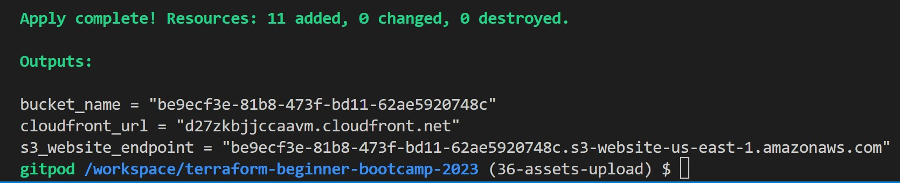

# Terraform Beginner Bootcamp 2023 - Week 1

## Root Module Structure

Our root module structure is as follows:

```
PROJECT_ROOT
│
├── main.tf                 # everything else.
├── variables.tf            # stores the structure of input variables
├── terraform.tfvars        # the data of variables we want to load into our terraform project
├── providers.tf            # defined required providers and their configuration
├── outputs.tf              # stores our outputs
└── README.md               # required for root modules
```

[Standard Module Structure](https://developer.hashicorp.com/terraform/language/modules/develop/structure)

## Terraform and Input Variables

### Terraform Cloud Variables

In terraform we can set two kind of variables:
- Enviroment Variables - those you would set in your bash terminal eg. AWS credentials
- Terraform Variables - those that you would normally set in your tfvars file

We can set Terraform Cloud variables to be sensitive so they are not shown visibliy in the UI.

### Loading Terraform Input Variables

[Terraform Input Variables](https://developer.hashicorp.com/terraform/language/values/variables)

### var flag
We can use the `-var` flag to set an input variable or override a variable in the tfvars file eg. `terraform -var user_ud="my-user_id"`

### var-file flag

- In Terraform, the var-file flag is used to specify a variable file that contains values for variables defined in your Terraform configuration. This flag is particularly useful when you want to separate your variable values from your main configuration file, making it easier to manage different configurations for different environments or to keep sensitive information, such as API keys or passwords, separate from your main code.

    By using the -var-file flag, you can easily switch between different sets of variable values for different environments (e.g., development, staging, production) without modifying your main configuration files. This makes it easier to manage your infrastructure as code and maintain a separation of concerns between configuration and variable values.

### terraform.tvfars

This is the default file to load in terraform variables in blunk

### auto.tfvars

- **In Terraform, `auto.tfvars`** is a special filename that Terraform automatically looks for when you run Terraform commands like `terraform apply` or `terraform plan`. This file allows you to define default values for variables without explicitly specifying them on the command line or in a separate variable file.

Here's how it works:

1. **Create `auto.tfvars`**: In your Terraform project directory, create a file named `auto.tfvars` (or `auto.tfvars.json` for JSON formatted variables) if it doesn't already exist.

2. **Define Variable Values**: Inside the `auto.tfvars` file, you can define default values for your variables. For example:

   ```hcl
   variable_name = "default_value"
   another_variable = 42


### order of terraform variables

- In Terraform, the order of variables typically doesn't matter because variables are declared and then used as needed throughout your Terraform configuration. However, there are some conventions and best practices you can follow for organizing and documenting your variables:

1. **Variable Declarations:** Variables are typically declared at the beginning of your Terraform configuration file(s). This is where you specify the variable name, type, and optional default value. Here's an example:

```hcl
variable "instance_type" {
  type    = string
  default = "t2.micro"
}

variable "region" {
  type    = string
  default = "us-east-1"
}

```

2. **Resource Blocks:** Variables are often used within resource blocks, data blocks, or other configurations to parameterize your infrastructure. These resource blocks can be placed anywhere in your Terraform configuration file(s) as needed:

```hcl
resource "aws_instance" "example" {
  ami           = "ami-12345678"
  instance_type = var.instance_type
  subnet_id     = "subnet-12345678"
  tags = {
    Name = "example-instance"
  }
}
```


In Terraform, the order of variables typically doesn't matter because variables are declared and then used as needed throughout your Terraform configuration. However, there are some conventions and best practices you can follow for organizing and documenting your variables:

**Variable Declarations:** Variables are typically declared at the beginning of your Terraform configuration file(s). This is where you specify the variable name, type, and optional default value. Here's an example:

```hcl
Copy code
variable "instance_type" {
  type    = string
  default = "t2.micro"
}

variable "region" {
  type    = string
  default = "us-east-1"
}
```

**Resource Blocks:** Variables are often used within resource blocks, data blocks, or other configurations to parameterize your infrastructure. These resource blocks can be placed anywhere in your Terraform configuration file(s) as needed:

```hcl
Copy code
resource "aws_instance" "example" {
  ami           = "ami-12345678"
  instance_type = var.instance_type
  subnet_id     = "subnet-12345678"
  tags = {
    Name = "example-instance"
  }
}
```

3. **Variable Values:** When you assign values to variables, you can do so in various ways:

- Using default values in the variable declarations.
- Using explicit variable values when running Terraform commands, either through command-line flags (`-var`) or a variable file (`-var-file`).
- Using interpolation to derive values based on other variables or data sources.
The order in which you assign variable values, whether through default values, explicit values, or interpolations, doesn't matter from a functional perspective. Terraform will resolve the variable values during its execution.

4. **Documentation:** It's a good practice to include comments or documentation for each variable declaration to explain its purpose, valid values, and any additional context. This helps make your configuration more understandable for both yourself and your team members:

```hcl
variable "instance_type" {
  type        = string
  description = "The EC2 instance type for the example instance."
  default     = "t2.micro"
}
```

5. **Consistency and Style:** While the order of variables doesn't affect Terraform's functionality, maintaining a consistent style and organization in your code can make it more readable and maintainable. You may want to group related variables together or follow a specific naming convention for your variables.


## Dealing With Configuration Drift

## What happens if we lose our state file?

If you lose your statefile, you most likley have to tear down all your cloud infrastructure manually.

You can use terraform port but it won't for all cloud resources. You need check the terraform providers documentation for which resources support import.

### Fix Missing Resources with Terraform Import

`terraform import aws_s3_bucket.bucket bucket-name`

[Terraform Import](https://developer.hashicorp.com/terraform/cli/import)
[AWS S3 Bucket Import](https://registry.terraform.io/providers/hashicorp/aws/latest/docs/resources/s3_bucket#import)

### Fix Manual Configuration

If someone goes and delete or modifies cloud resource manually through ClickOps. 

If we run Terraform plan is with attempt to put our infrstraucture back into the expected state fixing Configuration Drift


## Fix using Terraform Refresh

```sh
terraform apply -refresh-only -auto-approve
```

## Using Terraform Refresh

Terraform `refresh` is a command used to update the state file with the real-world infrastructure's current status. It does not modify or fix your infrastructure; instead, it updates Terraform's understanding of the actual resources in your infrastructure. Here's how to use `terraform refresh`:

1. Navigate to your Terraform project directory in your terminal.

2. Ensure that your Terraform configuration files (usually with `.tf` extension) are in place.

3. Run the following command to refresh the state:

   ```bash
   terraform refresh

his command will update the state file with the latest information from your actual infrastructure. It's useful when you want to sync Terraform's state with the real-world infrastructure if changes were made outside of Terraform, such as manual changes to resources or updates made through another tool.

Remember that terraform refresh does not make any changes to your infrastructure. It only updates Terraform's understanding of the current state. If you need to apply changes to your infrastructure based on your Terraform configuration, you should use terraform apply after making the necessary modifications to your .tf files.


## Terraform Modules

### Terraform Module Structure

It is recommend to place modules in a `modules` directory when locally developing modules but you can name it whatever you like.

### Passing Input Variables

We can pass input variables to our module.
The module has to declare the terraform variables in its own variables.tf

```tf
module "terrahouse_aws" {
  source = "./modules/terrahouse_aws"
  user_uuid = var.user_uuid
  bucket_name = var.bucket_name
}
```

### Modules Sources

Using the source we can import the module from various places eg:
- locally
- Github
- Terraform Registry

```tf
module "terrahouse_aws" {
  source = "./modules/terrahouse_aws"
}
```


[Modules Sources](https://developer.hashicorp.com/terraform/language/modules/sources)

## Considerations when using ChatGPT to write Terraform

LLMs such as ChatGPT may not be trained on the latest documentation or information about Terraform.

It may likely produce older examples that could be deprecated. Often affecting providers.

## Working with Files in Terraform


### Fileexists function

This is a built in terraform function to check the existance of a file.

```tf
condition = fileexists(var.error_html_filepath)
```

https://developer.hashicorp.com/terraform/language/functions/fileexists

### Filemd5

https://developer.hashicorp.com/terraform/language/functions/filemd5

### Path Variable

In terraform there is a special variable called `path` that allows us to reference local paths:
- path.module = get the path for the current module
- path.root = get the path for the root module
[Special Path Variable](https://developer.hashicorp.com/terraform/language/expressions/references#filesystem-and-workspace-info)


resource "aws_s3_object" "index_html" {
  bucket = aws_s3_bucket.website_bucket.bucket
  key    = "index.html"
  source = "${path.root}/public/index.html"
}

## Terraform Locals

Locals allows us to define local variables.
It can be very useful when we need transform data into another format and have referenced a varaible.

```tf
locals {
  s3_origin_id = "MyS3Origin"
}
```
[Local Values](https://developer.hashicorp.com/terraform/language/values/locals)

## Terraform Data Sources

This allows use to source data from cloud resources.

This is useful when we want to reference cloud resources without importing them.

```tf
data "aws_caller_identity" "current" {}
output "account_id" {
  value = data.aws_caller_identity.current.account_id
}
```
[Data Sources](https://developer.hashicorp.com/terraform/language/data-sources)

## Working with JSON

We use the jsonencode to create the json policy inline in the hcl.

```tf
> jsonencode({"hello"="world"})
{"hello":"world"}
```

[jsonencode](https://developer.hashicorp.com/terraform/language/functions/jsonencode)

### Changing the Lifecycle of Resources

[Meta Arguments Lifcycle](https://developer.hashicorp.com/terraform/language/meta-arguments/lifecycle)


## Terraform Data

Plain data values such as Local Values and Input Variables don't have any side-effects to plan against and so they aren't valid in replace_triggered_by. You can use terraform_data's behavior of planning an action each time input changes to indirectly use a plain value to trigger replacement.

https://developer.hashicorp.com/terraform/language/resources/terraform-data

## Provisioners

Provisioners allow you to execute commands on compute instances eg. a AWS CLI command.

They are not recommended for use by Hashicorp because Configuration Management tools such as Ansible are a better fit, but the functionality exists.

[Provisioners](https://developer.hashicorp.com/terraform/language/resources/provisioners/syntax)

### Local-exec

This will execute command on the machine running the terraform commands eg. plan apply

```tf
resource "aws_instance" "web" {
  # ...
  provisioner "local-exec" {
    command = "echo The server's IP address is ${self.private_ip}"
  }
}
```

https://developer.hashicorp.com/terraform/language/resources/provisioners/local-exec

### Remote-exec

This will execute commands on a machine which you target. You will need to provide credentials such as ssh to get into the machine.

```tf
resource "aws_instance" "web" {
  # ...
  # Establishes connection to be used by all
  # generic remote provisioners (i.e. file/remote-exec)
  connection {
    type     = "ssh"
    user     = "root"
    password = var.root_password
    host     = self.public_ip
  }
  provisioner "remote-exec" {
    inline = [
      "puppet apply",
      "consul join ${aws_instance.web.private_ip}",
    ]
  }
}
```
https://developer.hashicorp.com/terraform/language/resources/provisioners/remote-exec


https://developer.hashicorp.com/terraform/language/resources/provisioners/remote-exec

## For Each Expressions

For each allows us to enumerate over complex data types

```sh
[for s in var.list : upper(s)]
```

This is mostly useful when you are creating multiples of a cloud resource and you want to reduce the amount of repetitive terraform code.

[For Each Expressions](https://developer.hashicorp.com/terraform/language/expressions/for)


## Error encounter during assets upload

```sh
│ Error: Missing required argument
│ 
│   on main.tf line 19, in module "terrahouse_aws":
│   19: module "terrahouse_aws" {
│ 
│ The argument "assets_path" is required, but no definition was found.
╵
gitpod /workspace/terraform-beginner-bootcamp-2023 (36-assets-upload) $ 
```

### Solution

The error message you're encountering is telling you that there is a missing required argument in your Terraform configuration for a module named "terrahouse_aws," specifically the "assets_path" argument. You need to provide a value for this argument in your module configuration.

To fix this error, you should locate the module block for "terrahouse_aws" in your main.tf file and make sure you provide the "assets_path" argument with a valid value. Here's an example of how you can define the "assets_path" argument:

```hcl
module "terrahouse_aws" {
  source      = "./modules/terrahouse_aws"
  assets_path = "path/to/your/assets"
  # Other module arguments go here
}
```

Replace "path/to/your/assets" with the actual path to the assets you want to use in your module.

So, i have added the following code snipet to main.tf:

```sh
assets_path = "/workspace/terraform-beginner-bootcamp-2023/public/assets/"
```



I have used the following command to destroy the newly generated cloudfront using terraform:

```terraform
terraform destroy --auto-approve
```
